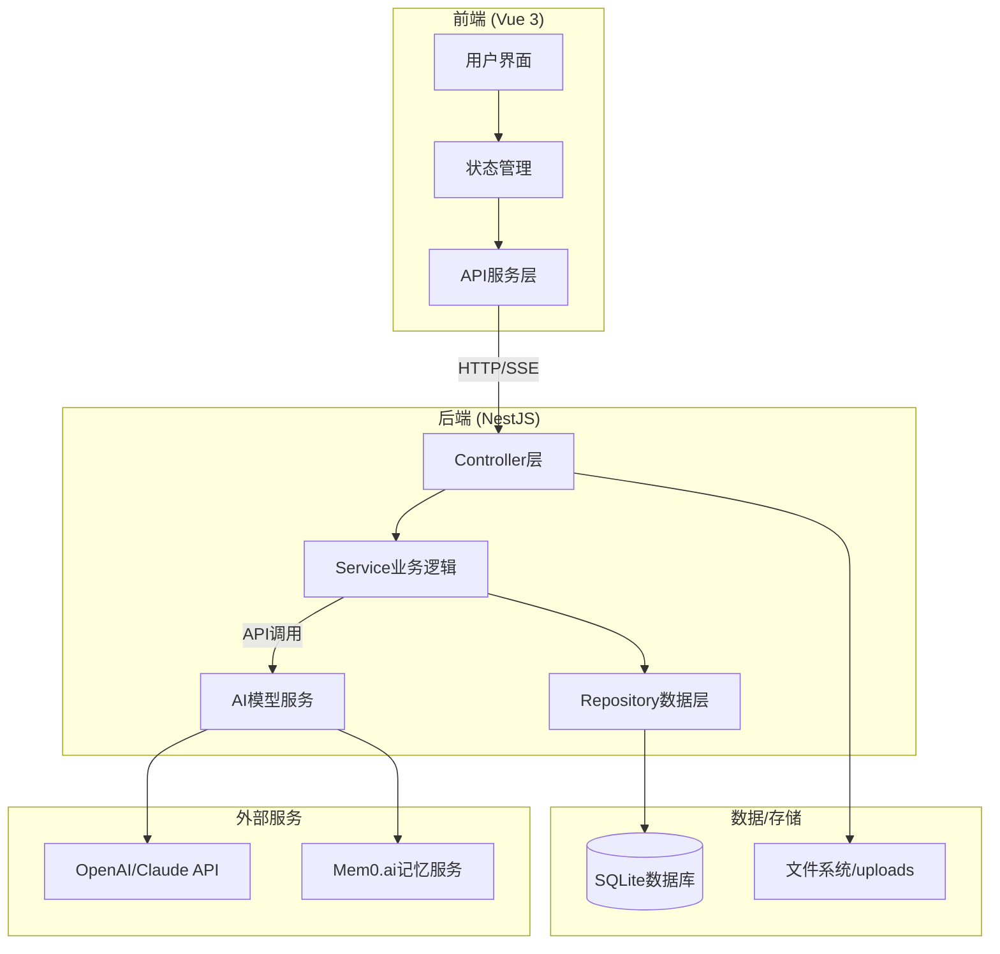
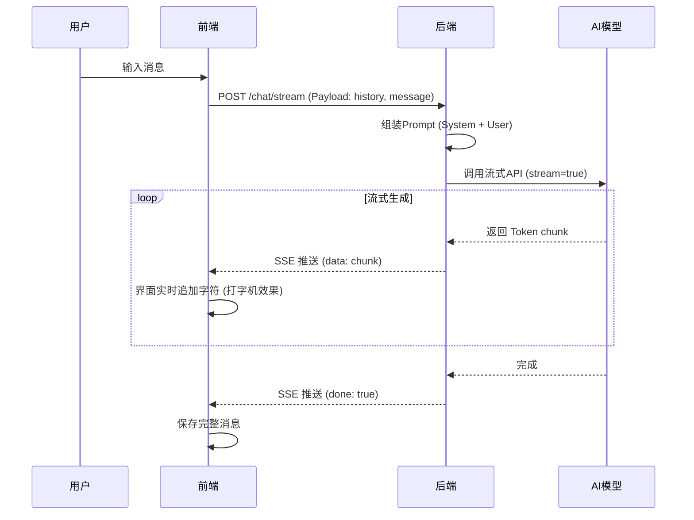

# 角色扮演AI对话平台 - 考核答辩文档

> **项目名称**：AI Role-Playing Chat Platform
> **开发者**：AI + 开发培训学员
> **开发环境**：Google Antigravity (AI Native IDE)
> **文档用途**：2026年1月 入门阶段考核答辩专用

---

## 目录

1. [项目概述](#1-项目概述)
2. [系统架构](#2-系统架构)
3. [核心技术栈](#3-核心技术栈)
4. [核心功能与数据流转](#4-核心功能与数据流转)
5. [AI应用与实践](#5-ai应用与实践)
6. [安全与部署](#6-安全与部署)
7. [附录：答辩准备清单](#7-附录答辩准备清单)

---

## 1. 项目概述

### 1.1 项目愿景
打造一个**沉浸式角色扮演AI对话平台**，让用户能够与性格各异的虚拟角色进行深度互动。平台不仅支持文本对话，还实现了**流式打字机效果**和**多模态图片交互**，为用户提供接近真人的聊天体验。

### 1.2 核心功能清单
本项目已达成所有考核要求功能：

| 功能模块 | 详细实现 |
|----------|----------|
| **角色管理** | 支持创建、编辑、删除虚拟角色，配置详细人设（System Prompt） |
| **智能对话** | 集成OpenAI/Anthropic等大模型，基于人设进行个性化回复 |
| **流式渲染** | 使用SSE（Server-Sent Events）技术，实现逐字显示的打字机效果 |
| **视觉交互** | 支持用户发送图片，AI通过多模态模型（Vision Model）识别内容并点评 |
| **历史管理** | 完整保存对话记录，支持多会话切换，实现上下文记忆 |
| **多模型支持** | 支持在前端灵活切换和配置不同的AI模型（OpenAI, DeepSeek等） |
| **长期记忆** | 集成Mem0.ai，实现跨会话的智能记忆功能 |

### 1.3 示例角色展示
- **Lina (傲娇魔法少女)**：强调"Stay in Character"，性格傲娇但善良，使用emoji。
- **Sister (温柔邻家姐姐)**：善于倾听，语气温柔，特定口癖（"呢"、"呀"）。
- **Phantom (赛博黑客)**：高冷技术流，使用技术术语，赛博朋克风格。

---

## 2. 系统架构

### 2.1 系统整体架构图
本项目采用经典的前后端分离架构，数据流转清晰：



### 2.2 前端架构 (Directory Structure)
前端采用 **Vue 3 + Composition API**，强调组件化和逻辑复用。

- `src/views/`: 页面级组件 (Home.vue, Chat.vue)
- `src/components/`: 业务组件 (ChatBubble, InputArea, CharacterCard)
- `src/composables/`: 复用逻辑 (useChatHistory.js - 管理消息状态)
- `src/services/`: API封装 (api.js - 统一管理HTTP请求)

### 2.3 后端架构 (Module Division)
后端采用 **NestJS** 模块化设计，职责分明：

- `CharactersModule`: 处理角色CRUD。
- `ChatModule`: 核心对话逻辑，处理SSE流式响应。
- `UploadModule`: 处理图片上传与静态文件服务。
- `ModelsModule`: 管理AI模型配置与加密存储。

---

## 3. 核心技术栈

### 3.1 技术选型与理由

| 技术领域 | 选型 | 考核评分点/选型理由 |
|----------|------|---------------------|
| **前端框架** | **Vue 3** | 响应式系统强大（Ref/Reactive），Composition API逻辑复用性高，适合快速构建交互复杂的SPA。 |
| **构建工具** | **Vite** | 极速冷启动和热更新（HMR），显著提升开发体验。 |
| **后端框架** | **NestJS** | 企业级Node.js框架，提供完整的模块化、依赖注入（DI）机制，代码结构清晰规范。 |
| **数据库** | **SQLite** | **轻量级、零配置**。对于展示型项目，无需额外部署数据库服务，且通过TypeORM可轻松迁移至MySQL。 |
| **ORM** | **TypeORM** | 定义Entity实体类，自动同步数据库表结构，操作安全方便。 |
| **AI集成** | **OpenAI SDK** | 标准化接口，兼容性和扩展性好（可兼容DeepSeek等）。 |

---

## 4. 核心功能与数据流转

> **考核重点**：本章节对应答辩中"数据流转"和"核心代码"的考察点。

### 4.1 完整对话数据流 (Data Flow)
**流式响应如何从后端传输到前端展示？**

1. **用户输入**：用户点击发送 -> 前端调用 `POST /chat/stream`，携带 `message` 和 `history`。
2. **后端处理**：
   - `ChatController` 接收请求。
   - `ChatService` 构建 Prompt（System Prompt + 记忆 + 历史消息）。
   - 调用 `openai.chat.completions.create({ stream: true })`。
3. **流式生成**：
   - OpenAI API 逐个 Token 返回数据。
   - 后端使用 `AsyncGenerator` 捕获数据块。
4. **SSE推送**：后端通过 `Server-Sent Events` 将数据包装成 `data: {"content":"..."}` 推送给前端。
5. **前端渲染**：
   - `fetch` 获取 `ReadableStream`。
   - 循环读取 chunk，拼接字符串。
   - 实时更新 `messages.value`，界面产生打字机效果。



### 4.2 图片上传与多模态流程
**图片上传从前端到存储的完整路径：**

1. **选择与压缩**：前端使用 `Compressor.js` 压缩图片（<1MB），提升传输速度。
2. **上传请求**：`FormData` 封装图片 -> `POST /upload`。
3. **后端存储**：`Multer` 中间件拦截 -> 校验类型 -> 保存至 `/uploads` 目录。
4. **返回URL**：返回 `/uploads/filename.jpg`。
5. **AI识别**：发送消息时，后端检测到图片URL -> 调用 `GLM-4v/GPT-4o` 视觉模型 -> 获取图片描述 -> 注入对话上下文。

### 4.3 Prompt工程与组织逻辑
**系统提示词是如何组织的？**

消息构建逻辑如下（优先级从高到低）：
1. **System Prompt**：角色的核心人设（"你是一个..."）。
2. **Context Memory**：从Mem0检索的相关长期记忆。
3. **Few-Shot Examples**：内置的示例对话（教会AI说话风格）。
4. **Chat History**：最近20轮对话历史（滑动窗口）。
5. **Current Message**：用户当前发送的消息（包含图片描述）。

---

## 5. AI应用与实践

> **考核重点**：必须展示AI如何辅助开发，而非仅仅由AI生成代码。

### 5.1 AI协作矩阵
在开发过程中，我使用了 **Google Antigravity** IDE，通过多Agent协作模式提升效率：

| 场景 | AI工具 | 具体应用案例 |
|------|--------|--------------|
| **UI设计** | **Gemini 3 Pro** | 生成了Glassmorphism（毛玻璃）风格的CSS代码，设计了聊天气泡的动画效果。 |
| **逻辑构建** | **Claude Sonnet 4.5** | 设计了SSE流式传输的后端架构，解决了TypeORM的实体通过DTO传输的问题。 |
| **Bug修复** | **Codex** | **SSE Buffer Bug**：快速定位到流式数据分片导致JSON解析错误的问题，并提供了 buffer 拼接的修复代码。 |
| **Git管理** | **GLM 4.7** | 自动生成了符合 Conventional Commits 规范的提交信息。 |

### 5.2 典型问题解决 (AI辅助)
**案例：SSE流式响应JSON解析错误**
- **问题**：前端报错 `SyntaxError: Unexpected token`。
- **AI分析**：Codex 指出 TCP 数据包分片可能导致一行 SSE 数据被截断。
- **解决方案**：AI 建议在前端实现 `buffer` 机制，将未完成的行暂存，等到下一次 chunk 到达后再拼接解析。
- **思考**：通过此Bug理解了HTTP流式传输的底层原理，不再单纯依赖库，而是理解了数据包的边界处理。

---

## 6. 安全与部署

### 6.1 API Key 安全
- **加密存储**：API Key 在数据库中通过 `AES-256-CBC` 加密。
- **前端脱敏**：前端仅显示 `sk-****abcd`，防止密钥泄露。

### 6.2 启动与运行
```bash
# 一键启动脚本
./start.sh
```
该脚本同时启动后端（Port 3000）和前端（Port 5173），并自动检查环境依赖。

---

## 7. 附录：答辩准备清单

### 7.1 答辩流程 Checklist
- [ ] **运行环境**：确保本地服务运行正常，`./start.sh` 无报错。
- [ ] **功能演示**：
  - [ ] 发送文本，展示流式打字机效果。
  - [ ] 发送图片，展示AI识别并回复。
  - [ ] 切换角色，展示不同人设的回复差异。
  - [ ] 刷新页面，展示历史记录不丢失。
- [ ] **代码准备**：
  - [ ] 打开 `chat.service.ts` (展示流式逻辑)。
  - [ ] 打开 `Chat.vue` (展示前端SSE处理)。
  - [ ] 打开 `character.entity.ts` (展示数据库设计)。

### 7.2 必问技术题 (FAQ)
1. **为什么不需要WebSocket而用SSE？**
   - *答*：WebSocket是双向通信，SSE是单向（Server->Client）。对于AI聊天，主要是服务器推送回复，SSE更轻量，由HTTP原生支持，不仅防火墙友好，且断线重连更简单。
2. **Prompt是如何拼接的？**
   - *答*：System Prompt + History (最近N条) + User Input。为了防止Token溢出，做了滑动窗口限制。
3. **前端如何保持聊天滚动到底部？**
   - *答*：使用 Vue 的 `watch` 监听消息数组变化，配合 `nextTick` 在 DOM 更新后执行 scrollToBottom。

### 7.3 核心亮点（用于总结）
- **全栈完整性**：从前端UI到后端API再到数据库的完整链路。
- **现代化体验**：流式响应 + 多模态交互 + 毛玻璃UI。
- **AI原生开发**：深度结合AI工具解决复杂Bug（如SSE分片问题）。
